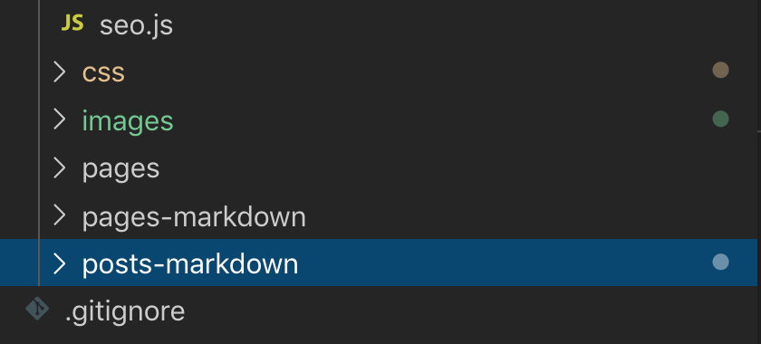

When working with markdown files and multiple page/content types in Gatsby, it can sometimes be useful to split your markdown files into separate directories. This can be helpful both from an organizational perspective, but also to help avoid potential issues with structural differences between content types. There are no requirements on how markdown directories should be broken up, but I find it helpful to name directories by content type name and append '-markdown' to the end of the file name. This helps to distinguish them from component directories.



When writing GraphQL queries to pull data from markdown files, errors can occur if there are differences in frontmatter field structure between different content types. This can sometimes be avoided by ensuring that queries for a specific content type only run on the directory containing the appropriate content type. There are likely multiple ways to accomplish this, but I was able to do this by adding a filter on the fileAbsolutePath field in my GraphQL queries. Below is an example which only queries markdown files in the posts-markdown directory. It is important to note that this filter runs on the entire file path, so it can generate false positives if your directory name is too generic.

```JavaScript
  // Excerpt from gatsby-node.js
  const result = await graphql(`
    {
      allMarkdownRemark(
        filter: { fileAbsolutePath: { regex: "/posts-markdown/" } }
        sort: { order: DESC, fields: [frontmatter___date] }
        limit: 1000
      ) {
        edges {
          node {
            frontmatter {
              path
            }
          }
        }
      }
    }
  `)
```


