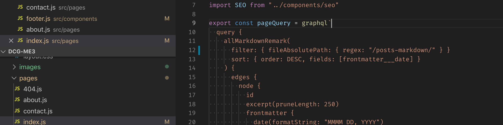

After doing Drupal 8 sites and module pretty much exclusively over the past few years, I decided to try something new and redo my personal website using Gatsby. At first I was planning to use Gatsby as the front end only and still use Drupal 8 to drive the backend CMS functionality, but ultimately I decided to go with a pure Gatsby build utilizing simple markdown files for both pages and posts. There were many factors that went into this decision, but the main reason was that it just wasn't necessary for what I needed. Adding a database and backend adds a significant amount of overhead to any project and as someone who spends all day in terminal windows and text editors, writing content in vscode actually ended up being more comfortable for me than using a traditional web content interface.

## Why Not Use Drupal?

I still love Drupal and use it every single day for my day job. It is a large and complex system though. For a simple site like this, I just didn't need most of the functionality that Drupal offers. The web development landscape is also changing and JavaScript frameworks are taking over the front end web development space at a breakneck pace. Do I think Php based CMS jobs are going away any time soon? Of course not. However, I do believe that strong core JavaScript and modern JS framework skills will become necessary for most web developers going forward. It's no longer feasible to be just a Drupal or Wordpress developer in most cases. Redoing this site in Gatsby gave me a chance to really focus on updating my JS toolbox and I do feel like I've picked up quite a few new skills along the way.

## What's So Great About Gatsby?

Gatsby is a static site generator and CMS front end in one. Gatsby sites are built in ReactJs and GraphQL, but get compiled down to blazing fast html and javascript during the build process. There are many plugins available to support different CMS backends, so the same framework can be used as the front end for many types of web projects. The documentation for Gatsby is superb for an open source project and the community behind the project is active and extremely positive. Overall, I'm am extremely impressed with what Gatsby has to offer and plan to use it heavily for future projects.
